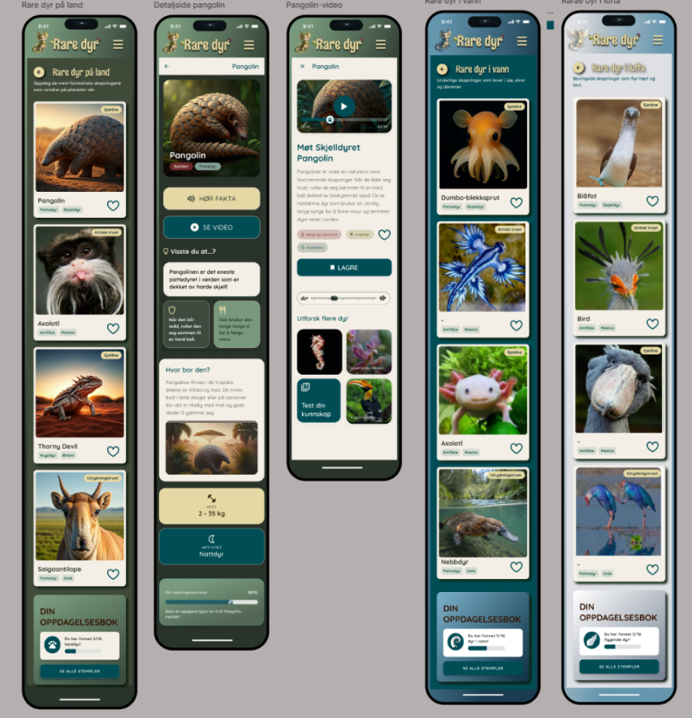
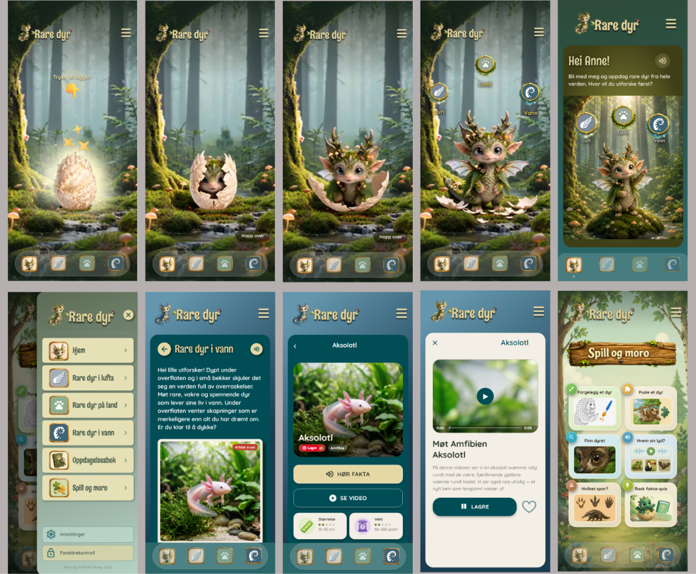

# Rare Dyr

> 🚧 **Dette prosjektet er under aktiv utvikling og er ikke ferdig.** Innhold, design og funksjonalitet vil endre seg underveis.

**Rare Dyr** er en interaktiv mobilapp for barn (ca. 6–12 år) som lar brukeren utforske sjeldne og fascinerende dyr gjennom bilder, korte beskrivelser og en leken opplevelse.

## Prosessoversikt
Dette prosjektet viser hele arbeidsflyten min fra idé til fungerende mobilapp:

-planlegging i Figma (lo‑fi → hi‑fi)

-personas og brukerforståelse

-utvikling av mobilapp i React Native / Expo

-videre arbeid med å lære WordPress for å lage en tilhørende nettside

Dette repoet inneholder koden til appen, mens README‑en dokumenterer hele prosessen.

## Designprosess i Figma
Jeg startet med å utforske idéen visuelt:

-lo‑fi wireframes for struktur

-persona for å forstå målgruppen (barn 6–12 år)

-hi‑fi mockups som grunnlag for appens UI

-fokus på tydelige former, store elementer og barnlig nysgjerrighet



Figma‑fil: (...)

## Utvikling i VS Code
Dette er min første mobilapp, og jeg har jobbet med:

-React Native + Expo

-komponentstruktur og navigasjon

-bildehåndtering og layout




## WordPress‑læring
Jeg har begynt å utforske WordPress for å lage en enkel presentasjonsside for prosjektet. Målet er å lære:

- struktur og navigasjon
- hvordan design fra Figma oversettes til blokker og seksjoner
- visuell konsistens mellom app og nettside

## Bakgrunn og motivasjon
Jeg er utdannet førskolelærer, og er spesielt interessert i å lage digitale opplevelser for barn hvor en kan kombinere fantasi, historiefortelling og læring. "Rare Dyr" er et prosjekt der jeg har fått utforske nettopp dette, og samtidig lære mobilutvikling fra bunnen av.

## Teknologi
-React Native

-Expo

-JavaScript

-Figma

-WordPress (under arbeid)

## Kom i gang
Installer avhengigheter:

```bash
npm install
```

Start prosjektet:

```bash
npx expo start
```


## Læringsmål
Gjennom prosjektet har jeg lært:

-hvordan man går fra idé til ferdig app

-hvordan design påvirker brukeropplevelse

-grunnleggende mobilutvikling

-sammenhengen mellom design (Figma) og kode

-hvordan bygge en prosess som ligner ekte produktutvikling

## Videre arbeid
Jeg ønsker å:

-forbedre interaksjoner og brukerflyt

-legge til flere dyr og mer innhold

-utforske animasjon og lyd

-bygge en tilhørende WordPress‑side

-teste appen på faktiske brukere

Laget som et læringsprosjekt med fokus på design, kreativitet og brukeropplevelse for barn.